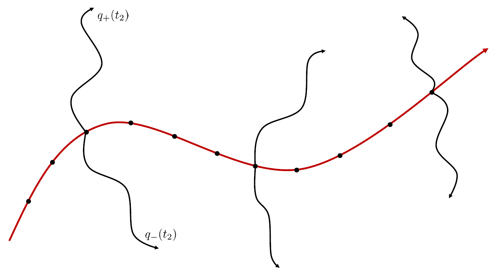

# i-pi-eq\_neq\_spectra

This is a modification of the original i-pi code that can compute equilibrium-nonequilibrium response function associated with several types of two-time, two-dimensional spectroscopies.
The instructions below assume that you know how to use i-pi. Its documentation and tutorials can be found at https://github.com/i-pi/i-pi.
Credit for nearly all parts of this code go to the developers of i-pi. Main modifications specific to this version are in the drivers/driver.f90 file and in two new files:
* drivers/pes/h2o\_dip\_pol.f90 - implements dipoles and polarizabilities for water according to a truncated dipole-induced-dipole model
* tools/py/eq\_neq\_spectra.py - implements equilibrium-nonequilibrium dynamics

## Installation

To get started, clone the repository, source the environment settings, and compile the driver code:
```
git clone git@github.com:tbegusic/i-pi.git

cd i-pi
source env.sh

cd drivers
make
cd ..
```

See i-pi documentation for running initial tests.

## Usage

A detailed example is provided in examples/tools/eq\_neq\_spectra. In short, the i-pi-eq\_neq\_spectra is used similar to i-pi, but takes in two inputs:
```
i-pi-eq_neq_spectra input.xml input_spec.xml > output &
```
where input.xml is the standard i-pi input and input\_spec.xml is the input that defines parameters for nonequilibrium trajectories. See example for details of the inputs.

## Background

The goal is to compute two-time response functions related to different types of two-dimensional infrared-Raman spectroscopies. For example, the infrared-infrared-Raman (IIR) spectrum would be computed from
$$R(t_1, t_2) = \frac{\beta}{\varepsilon}\langle [\Pi_{+}(t_2) - \Pi_{-}(t_2)] \dot{\mu}(-t_1) \rangle,$$
where $\mu$ is the dipole moment and $\Pi$ the polarizability, $\langle \cdot \rangle$ denotes a classical thermal average, and $\Pi_{\pm}$ corresponds to nonequilibrium trajectories that are initiated with an initially modified momentum $p_{\pm, 0} = p_0 \pm (\varepsilon/2) \mu^{\prime}$. $\varepsilon$ controls the strength of the perturbation and $\mu^{\prime}$ is the gradient of the dipole moment evaluated at the initial position. To evaluate this response function, we must propagate equilibrium and nonequilibrium dynamics as shown in the scheme below. i-pi-eq_neq_spectra code allows exactly that and can be further combined with the [encorr](https://github.com/tbegusic/encorr) code for computing the response function.

<p align="center">

</p>

Specifically, in i-pi-eq_neq_spectra, we first propagate the equilibrium trajectory fully (total time specified in the input.xml file) and then go back to each checkpoint file created along this trajectory and initiate a new nonequilibrium trajectory from it (propagated for a total time specified in the input_spec.xml file). For time steps at which the checkpoint file is created, one must also output the derivative of the dipole moment, so that the modified momentum can be computed.
